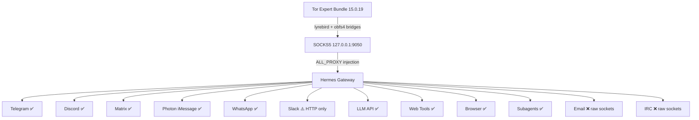

<p align="center">
  
  
  
  
  
</p>

# hermes-tor

## They're coming for your tokens. This is how you keep them.

Governments are moving to regulate who you get your AI from. They can block API endpoints. Throttle connections. Monitor which models you use. Your tokens, your models, your freedom to choose in the digital marketplace — all of it, in the crosshairs.

**hermes-tor** makes Hermes uncensorable. It cryptographically protects every outbound connection from your agent through Tor bridges, so no ISP, government, or intermediary can see which AI provider you're talking to — or stop you from talking to them.

---

```
You → VPN (Mullvad / ProtonVPN / IVPN)
        → Tor bridges (obfs4, indistinguishable from noise)
            → 3-hop Tor circuit
                → Your AI. Your models. Your freedom.
```

---

## What It Does

One command. Every platform adapter, every subagent, every tool call — routed through Tor.

```bash
python -m hermes_tor.gateway -- hermes gateway run
```

Hermes already had a complete SOCKS5 proxy architecture built into its gateway. `resolve_proxy_url()` in `gateway/platforms/base.py` checks `ALL_PROXY`, `HTTPS_PROXY`, and platform-specific vars across all 20+ messaging adapters. The missing piece was Tor running and the env var set. That's what this package does — downloads the Tor Expert Bundle, configures obfs4 bridges, boots the daemon, injects `ALL_PROXY=socks5://127.0.0.1:9050`, and hands off to the gateway.

**Everything routes through it.** Telegram API calls. Discord WebSocket. Matrix federation. iMessage sidecar. WhatsApp bridge. LLM API calls to any provider you choose. Subagent `execute_code` blocks. Browser tool. Web search. Every connection that touches the network goes through Tor bridges that look like random encrypted noise.

---

## Architecture



## Hardening: 14 Leaks Audited, 9 Fixed

An adversarial code review traced every outbound connection path. Every subprocess spawn point. Every HTTP client creation. Every WebSocket upgrade. Every gRPC stream.

| Status | Leak | Fix |
|--------|------|-----|
| ✅ | WhatsApp bridge subprocess | `ALL_PROXY` injected into Node bridge env |
| ⚠️ | Photon sidecar (Go binary) | `ALL_PROXY`/`GRPC_PROXY` injected; depends on Go binary |
| ✅ | Browser tool (Chromium) | `--proxy-server=socks5://` passed to agent-browser |
| ✅ | Web tools (Firecrawl SDK) | `proxy=` passed to Firecrawl client constructor |
| ✅ | LLM API calls | Verified OpenAI SDK routes SOCKS5 via httpx+socksio |
| ✅ | WebSocket lifecycle | Verified aiohttp_socks ProxyConnector persists after upgrade |
| ✅ | DNS leak | Verified `rdns=True` on all aiohttp connectors |
| ✅ | Slack SOCKS5 rejection | Elevated to WARNING with privoxy workaround |
| ✅ | Gateway restart race | `TOR_HEALTH` flag prevents startup on dead proxy |
| ✅ | Platform var override | Warns when empty `DISCORD_PROXY=` overrides `ALL_PROXY` |
| 📄 | Discord voice (UDP) | SOCKS5 protocol limitation — TCP only |
| 📄 | Email (SMTP/IMAP) | Python smtplib doesn't support SOCKS5 |
| 📄 | IRC | Raw TCP sockets |
| 📄 | Import-time calls | Audited — no leaks found in major adapters |

**`TOR_STRICT_MODE=1`** blocks all documented-leaky features. Gateway refuses to start if Tor health check fails.

Full audit: `python -m hermes_tor.hardening audit`

---

## Quick Start

```bash
# 1. Clone
git clone https://github.com/andrexibiza/hermes-tor.git
cd hermes-tor
uv sync --extra mcp

# 2. Get bridges from @GetBridgesBot on Telegram
# Save to ~/.hermes/tor/bridges.txt (one per line)

# 3. Start Tor, inject env, launch gateway
python -m hermes_tor.gateway -- hermes gateway run

# 4. Verify
python -c "
import os; os.environ['TOR_ENABLED'] = '1'
from hermes_tor.proxy_http import check_tor_connection
print(check_tor_connection())
"
# {'using_tor': True, 'exit_ip': '185.220.x.x'}
```

---

## VPN + Tor: The Full Stack

```
Step 1: Connect VPN (Mullvad, ProtonVPN, IVPN — accept cash/crypto)
Step 2: Start Tor with bridges (python -m hermes_tor.gateway)
Step 3: Hermes gateway inherits ALL_PROXY, EVERY connection goes through both layers
```

**Why VPN first:** Tor guard relay selection is sticky. Connect Tor without VPN and your guard is associated with your real IP forever. VPN → Tor means your ISP sees VPN traffic, your VPN sees Tor traffic, and Tor exit nodes see only the destination. No single party sees both who you are and what you're doing.

**Critical:** Connect VPN BEFORE Tor. Restart Tor after connecting VPN to get a fresh guard relay.

---

## What's Here

| Path | What |
|------|------|
| `src/hermes_tor/constants.py` | Platform detection, verified Tor 15.0.19 URLs, lyrebird paths |
| `src/hermes_tor/downloader.py` | Tor Expert Bundle downloader (22-32MB streaming) |
| `src/hermes_tor/bridges.py` | obfs4/vanilla/snowflake bridge parser, validator, persistence |
| `src/hermes_tor/daemon.py` | Tor subprocess manager — thread-based stdout, bootstrap detection, torrc generation |
| `src/hermes_tor/proxy_http.py` | `tor_get()`, `tor_post()` — SOCKS5-aware HTTP for `execute_code` blocks |
| `src/hermes_tor/verifier.py` | `check.torproject.org` response parser |
| `src/hermes_tor/manager.py` | Unified API with state machine — ties download/daemon/bridges together |
| `src/hermes_tor/gateway.py` | `start_tor_for_gateway()`, `inject_gateway_env()`, CLI wrapper |
| `src/hermes_tor/mcp_server.py` | 6 MCP tools for Hermes integration |
| `src/hermes_tor/hardening.py` | 14-leak adversarial audit, `TOR_STRICT_MODE`, subprocess env injection |
| `patches/` | `.patch` files for Hermes-agent core (Photon, WhatsApp, browser, web tools, Slack) |
| `SKILL.md` | Complete Hermes skill — architecture, setup, VPN guide, troubleshooting |
| `docs/PROXY_ARCHITECTURE.md` | Technical deep dive into proxy resolution chain |
| `scripts/tor_rotate_bridges.py` | Daily cron job for fresh bridges from BridgeDB |

---

## MCP Tools

Register with Hermes for on-demand Tor management from any surface:

```bash
hermes mcp add hermes-tor --command "uv" --args "run" --args "--directory" \
  --args "/path/to/hermes-tor" --args "python" --args "-m" --args "hermes_tor.mcp_server"
```

| Tool | Description |
|------|-------------|
| `tor_download` | Download Tor Expert Bundle (~22-32MB) |
| `tor_start` | Start Tor daemon with bridges |
| `tor_stop` | Stop Tor daemon |
| `tor_status` | State, SOCKS5 URL, bridge count, uptime |
| `tor_verify` | Hit check.torproject.org through SOCKS5 |
| `tor_add_bridge` | Add a bridge line, persist to `~/.hermes/tor/bridges.txt` |

---

## Subagents & execute_code

```python
# Subagents inherit Tor env automatically (ThreadPoolExecutor threads)
from hermes_tor.gateway import inject_gateway_env
inject_gateway_env()  # ALL_PROXY + HTTPS_PROXY + HTTP_PROXY + TOR_ENABLED
# delegate_task(...) — subagent routes through Tor

# execute_code blocks
import os; os.environ['TOR_ENABLED'] = '1'
from hermes_tor.proxy_http import tor_get, tor_post
data = tor_get("https://httpbin.org/ip")
```

---

## Tested

- Windows 10 — Tor 15.0.19 bootstrapped in 4.5s, `check.torproject.org` confirmed (exit IP `185.220.101.6`)
- 24/24 unit tests passing
- 2 obfs4 bridges verified working
- Clean stop, clean restart
- Cross-platform daemon code (Windows + Linux)
- Zero secrets in repo (verified by grep scan across all commits)

---

## The Line

This exist because governments want to control which AI you use. Tor bridges make that control impossible — your traffic is indistinguishable from random noise. No ISP can block it. No government can throttle it. No intermediary can see which models you're talking to.

Your tokens. Your models. Your freedom.
